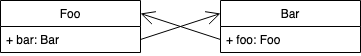

# 강한참조 vs 약한참조
ARC(Automatic Reference Counting)는 **컴파일 시점**에 retain relase 와 같은 메모리 관리 메소드를 자동으로 삽입해줍니다. 가비지 컬렉터와 달리 참조 사이클을 자동으로 처리하지 않기 때문에, 객체에 대한 강한참조가 남아 있는 경우 해당 객체는 메모리 해제가 되지 않게 됩니다. 

따라서 서로 다른 객체가 서로를 강하게 참조하게 되면  순환참조가 발생해 메모리 누수(Memory Leak)가 발생됩니다.

아래의 코드는 Foo와 Bar가 서로를 강하게 참조하여 순환참조가 발생되는 코드입니다.


class Foo {
  var bar: Bar?
}

class Bar {
  var foo: Foo?
}

let foo = Foo()
let bar = Bar()

foo.bar = bar   // Foo가 Bar를 강하게 참조
bar.foo = foo   // Bar가 Foo를 강하게 참조


# 순환참조란?

# weak vs unowned

